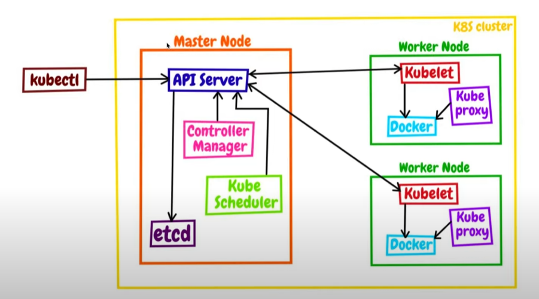

# Основыне компаненты кластера K8s

## Master node:
- Kube-apiserver:
  центральным компонентом для управления кластером. Принимает POST запросы.

- ETCD:
  Распределенное хранилище данных, хранит конфигураций кластера и состояний приложений.

- Kube-sheduler:
  Компонент, распределяет Pod-ы по ресурсам в кластере.

- Kube-controller-manager:
  Содержит контроллеры, которые управляют состоянием системы,
  такими как контроллер развертывания (Deployment Controller) или контроллер службы (Service Controller).

## Worker node:
- Kubelet:
  Агент, работающий на каждом узле кластера и отвечающий за управление контейнерами на уровне узла.
  Он принимает команды от мастера и обеспечивает их выполнение на узле.

- Kube-proxy:
  Обеспечивает сетевую абстракцию для сервисов на уровне узла.
  Он проксирует сетевой трафик к службам внутри кластера.

- Container runtime:
  Программное обеспечение, отвечающее за запуск контейнеров.
  Docker, containerd и CRI-O - это примеры контейнерных рантаймов.

## Объекты Kubernetes:
- [Pods:](./k8s_objects/Pods.md)
  Базовая единица в Kubernetes. Под представляет собой группу одного или нескольких контейнеров,
  объединенных вместе и разделяющих одно пространство имен, сеть и хранилище.

- [ReplicaSet:](./02_replica_set.yaml)
  Это объект в Kubernetes, который обеспечивает управление масштабированием и обеспечивает высокую доступность для подов (Pods).
  ReplicaSet гарантирует, что указанное количество реплик подов всегда будет работать в кластере.

- [Services:](./k8s_objects/Services.md)
  Абстракция, которая определяет статический набор подов и способ обращения к ним.
  Сервисы обеспечивают устойчивую точку доступа для приложения.

- [Deployments:](./k8s_objects/Deployments.md)
  Обеспечивает механихм обновления Pod'ов c помошью ReplicaSet'ов

- ConfigMaps и Secrets:
  Используются для управления конфигурациями и секретами, которые могут быть использованы приложениями в кластере.

## Дополнительные компоненты:
- Namespace:
  Изоляция ресурсов в кластере, позволяющая создавать виртуальные кластеры внутри общего кластера.

- Ingress:
  Позволяет управлять внешним доступом к службам в кластере.

- Persistent Volumes (PV) и Persistent Volume Claims (PVC):
  Позволяют создавать постоянное хранилище для приложений.

- PodSecurityPolicy (PSP):
  Управляет безопасностью контейнеров в подах.

   

## Вспомогательные файлы
- [ContainerProbes - Проверка доступности:](./k8s_objects/ContainerProbes.md)
- [Команды Kubectl:](./KubectlComands.md)
